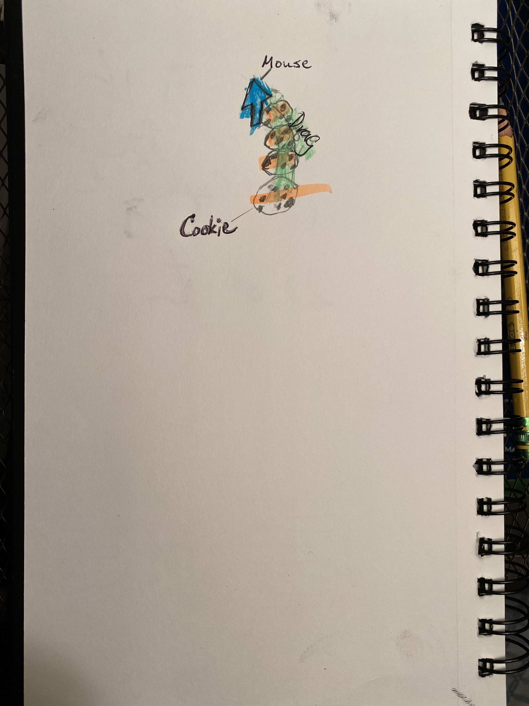
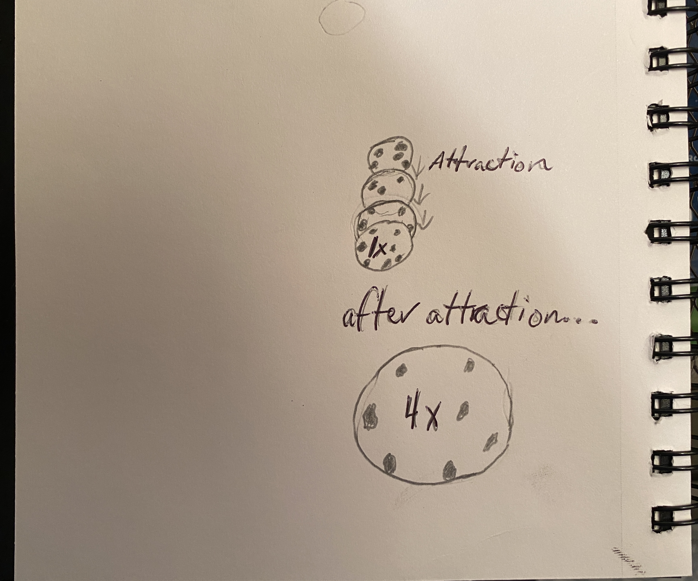

My scene will have the user drag their mouse across their screen (click, hold, and move the mouse in any direction). When they do that, it will create cookies (3D models).

The cookies interact with each other via attraction. As soon as two cookies are created, they begin to attract towards each other. Once they have become one (i.e. the second cookie completely overlapping the first), the cookie (second one; first one is removed from scene) doubles in size.
