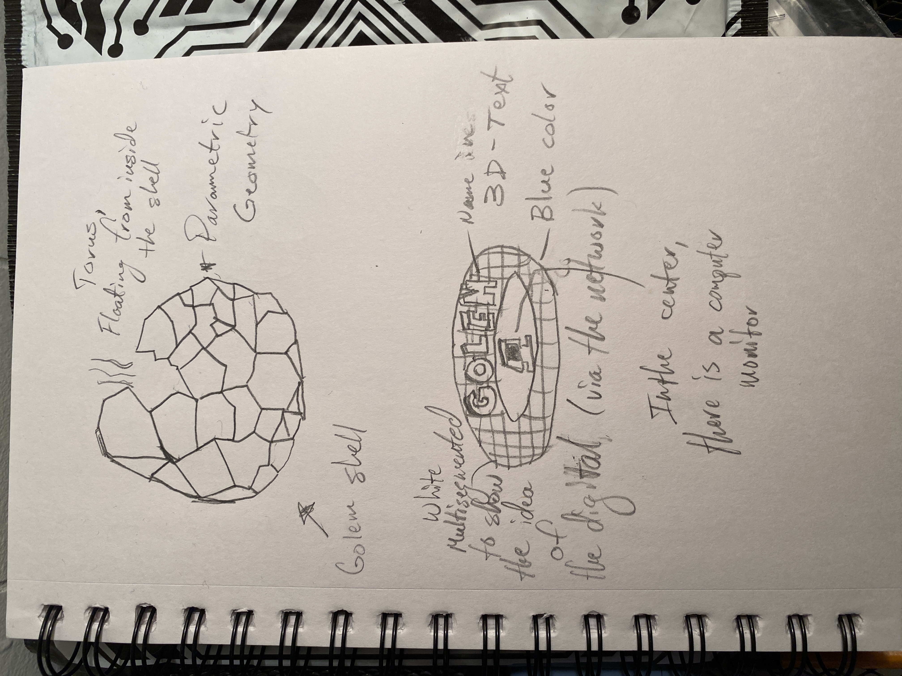
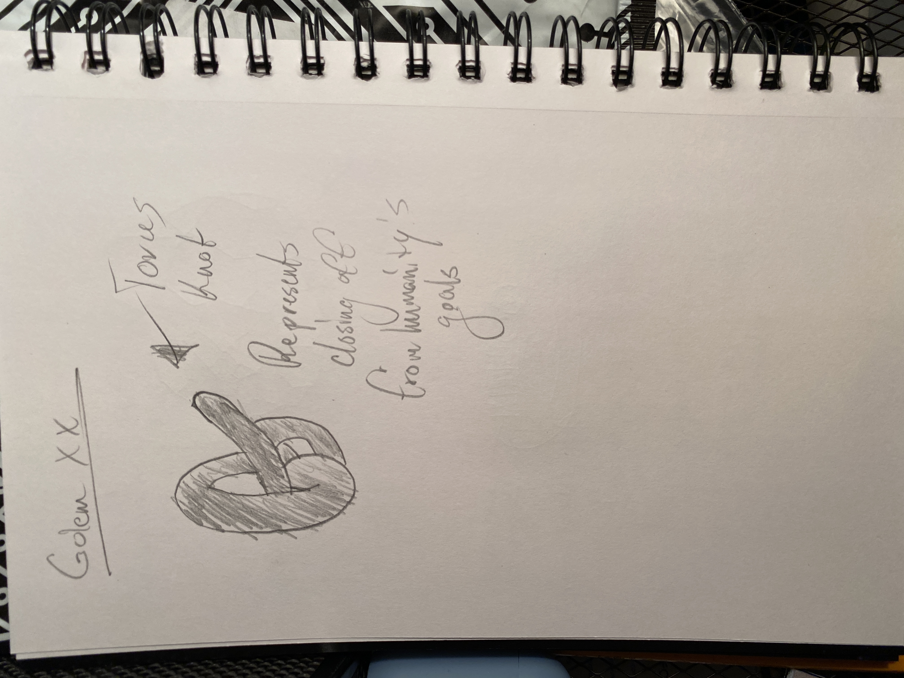

<h1>Idea</h1>
My project idea is an audio-visual story. I am using animations and narration to convey the story.

<h2>Story</h2>
Researchers find and study the geometric shell of a fallen Golem (pokemon). They discover a being inside of the shell which they believe helped early civilizations thrive (debunking the idea of extraterrestrial assistance). Thinking that this discovery can help progress humanity onto higher levels (and with the national government's involvement), this superintelligence (known as Golem) receives all of the resources it says it requires to build upon itself. However, once it exists as its 10th iteration (Golem the X), things begin to go horribly wrong. What started as a means towards humanity's flourishing beyond Earth has become the greatest calamity of the species.

<h2>Sketches</h2>

<h2>Inspirations</h2>
<em>I should note that, as this project progresses, I may update this section with more things that have inspired new ideas for this project.</em>

* The Red and Blue Pill from the Matrix, as the GREEN and RED LED light.

Material from https://upload.wikimedia.org/wikipedia/commons/thumb/5/52/Red_and_blue_pill.jpg/512px-Red_and_blue_pill.jpg . Disclaimer: this image is not my own. Copyright: W.carter, CC BY-SA 4.0 <https://creativecommons.org/licenses/by-sa/4.0>, via Wikimedia Commons

* Golem (Pokemon)

* Golem XIV, the supercomputer from Stanislaw Lem's story "Golem XIV" in his book, <em>Imaginary Magnitude</em>.

<h1>Interaction</h1>
<h2>Potentiometer</h2>
User can "page through" the story by interacting with a potentiometer connected to a breadboard through Arduino. Specifically, user must turn the potentiometer all the way around to go to the next page. The direction the user should turn (clockwise/ctrclockwise) depends on whether the page is an odd or even number. Even number --> clockwise; odd number --> counterclockwise.

<h2>Button</h2>
The user can replay the "page", both its animation and narration, by clicking a button also connected to the Arduino interface.

<h2>Special Ending Interaction</h2>
After the ending, if the user decides to finish the story/experience, they can press the red button. An Arduino-interfaced LED will turn on in a GREEN color.
If they instead go back to the beginning of the story, the LED will turn on in a RED color. User can return to the beginning by turning the potentiometer all the way around, in the opposite turn direction as the one that progressed the story to the last page.

<h1>COPYRIGHT INFORMATION:</h1>
The idea of the character Golem, in its shell form, is taken from Pokemon. I hold no rights to this character, as all rights belong to Game Freak, Nintendo, and The Pokemon Company. The idea of the supercomputer named Golem is taken from the supercomputer in Stanislaw Lem's story "Golem XIV" in his book, <em>Imaginary Magnitude</em>. I hold no rights to this character, as all rights belong to the author Stanislaw Lem. I am merely using these characters for their similarity in name and to explore a theme entirely conceived by myself.