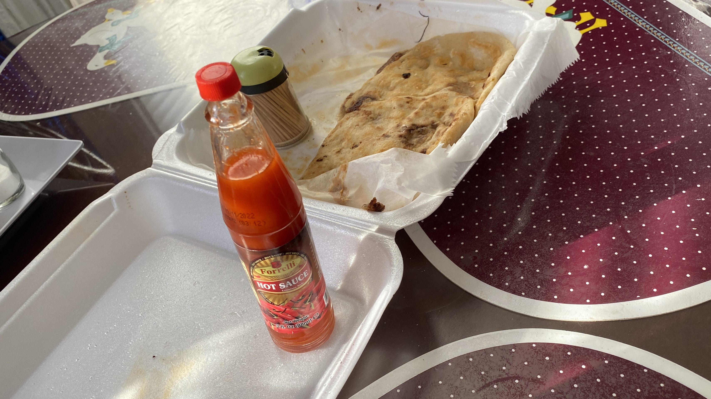

I will create a still-life rendition of a picture of my kitcken table. There will be various objects on a table.

One thing I'm already noticing is that many elements will be crucial to translating this image into three.js. Had I not considered this closely, I would probably have forgotten about elements such as shadowing and lighting (lighting as in how exactly light is hitting the objects in the photograph/three.js scene).

Even though it would probably be more effective and accurate to make my own 3D models for the hot sauce bottle and the toothpick container, I think I can use three.js's ConeGeometry, CapsuleGeometry, and CylinderGeometry to recreate these objects. After that, I'll try to hide certain aspects of these objects to make them look more like what they're supposed to look like (e.g. positioning the capsule that represents the toothpick container so that the bottom part isn't seen).

First problem I've run into comes as I attempt to make my first object. Even though I have the file CapsuleGeometry.js installed in the three.js geometries library, my main.ts script cannot recognize it when I create a new THREE.CapsuleGeometry. This means I have to use a 3D creator program to make the toothpick container.

I tried switching my 3D modeling workflow to Blender, after a session where I found Spline to be unresponsive and hard to work with at times. However, Blender presented its own problems when I exported two models (styrofoam container and the toothpick container). So, I've decided to go back to Spline and deal with any performance issues it may bring.

The first two models I've created took a very long time, even though they aren't very complicated models.

Another problem that's made me have to find an alternative is getting a nice pupusa texture onto my pupusa models. It seems I have to understand more about how textures work. Or maybe my source texture isn't set up right?

A similar problem happened when trying to set up a texture for my scene's background.